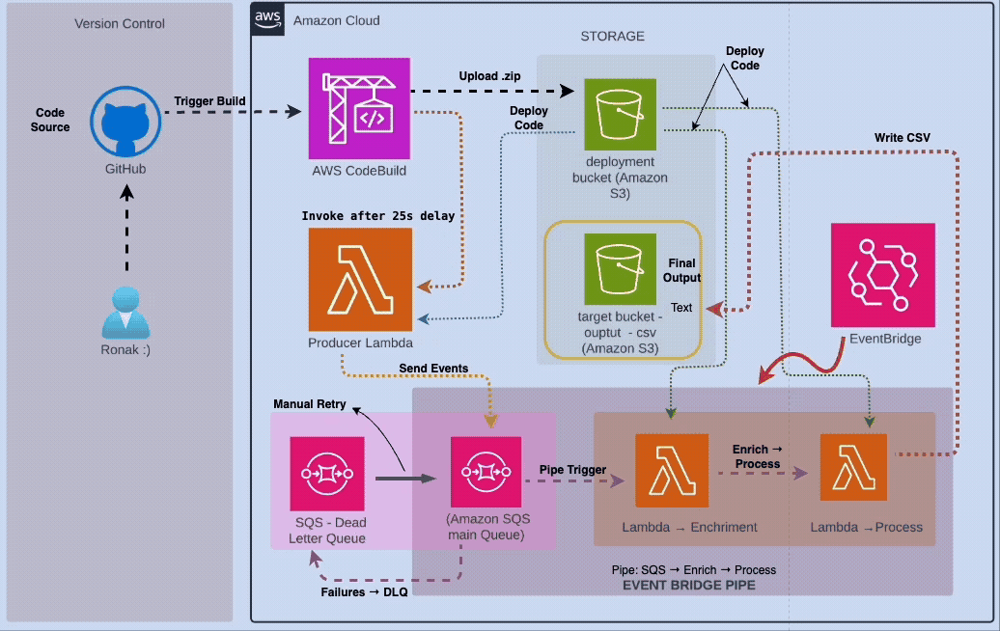

# 🏗️ Event-Driven Data Ingestion Pipeline on AWS

This project showcases a complete **event-driven streaming pipeline** built with AWS services using CI/CD and SQS + Lambda + EventBridge Pipes. It simulates the ingestion, enrichment, and processing of Airbnb-style booking events.



---

## 🔧 Technologies Used

- **Version Control:** GitHub
- **CI/CD:** AWS CodeBuild
- **Orchestration:** Amazon EventBridge Pipes
- **Messaging:** Amazon SQS + DLQ
- **Compute:** AWS Lambda
- **Storage:** Amazon S3
- **Language:** Python (with Pandas)

---

## 📦 Project Structure

```bash
.
├── produce_data/               # Producer Lambda (generates mock events)
├── process_data/               # Final processor Lambda (writes CSV to S3)
├── enrich_data/                # Enrichment Lambda (adds metadata)
├── buildspec.yml               # CodeBuild deployment script
├── .env                        # Lambda function names, bucket, etc.
├── deployment/                 # Zipped artifacts for upload
└── README.md
```

## 📌 Use Case

Imagine a system receiving **booking events** from an application like Airbnb. This project simulates that:

1. Mock booking events are produced.
2. They are sent to an **SQS queue**.
3. An **EventBridge Pipe** connects the queue to a processing chain of Lambdas:
   - **Enrichment Lambda** adds metadata like timestamp, etc.
   - **Processing Lambda** converts the final output to **CSV** and saves it to **S3**.

## ⚙️ How It Works (Step-by-Step)

### 1. **Code Trigger and Build**

- Code push to GitHub triggers **AWS CodeBuild**.
- CodeBuild packages Lambda code and uploads it to the **deployment S3 bucket**.
- Code and environment variables are deployed to:
  - `cl4-as-produce-streaming-data`
  - `cl4-as-process-streaming-data`
  - `cl4-as-process-streaming-data-enrichment`
- Producer Lambda is invoked after a **25-second delay** to allow env setup.

---

### 2. **Event Generation**

- **Producer Lambda** creates mock booking events and sends them to **SQS main queue**.
- If any message fails, it gets sent to the **Dead Letter Queue (DLQ)**.

### 3. **EventBridge Pipe**

- Pipe connects:  
  `SQS → Enrichment Lambda → Processing Lambda`
- **Enrichment Lambda** adds location/time-based info.
- **Processing Lambda** transforms JSON to **CSV** and writes to **S3 target bucket**.

---

### 4. **Manual Retry via DLQ**

- Failed messages land in **DLQ**.
- You can **manually retry** them by sending them back to the main queue for reprocessing.

---

## 📁 Sample Output

Final CSV gets saved to:  
`s3://event-driven-target-bucket-cl4-as/`

With structure like:

| bookingId | propertyId | price | location | timestamp |
| --------- | ---------- | ----- | -------- | --------- |

---

## ✅ Highlights

- Fully **serverless**
- CI/CD-driven deployment via CodeBuild
- Uses **EventBridge Pipes** for seamless chaining
- Real-world `SQS → Enrich → Process` pattern
- Supports **dead-letter handling** and **manual retries**

---

## 🧠 Future Enhancements

- Add Athena/Glue catalog for querying output
- Schedule periodic DLQ reprocessing
- Integrate notification alerts for DLQ via SNS
